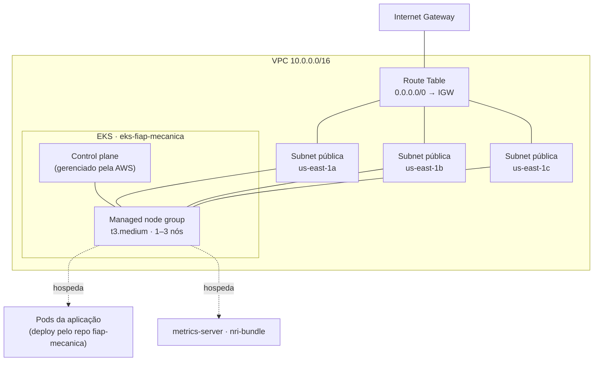

# Infraestrutura Kubernetes — fiap-mecanica-infra-k8s (Terraform)

## Propósito

Provisiona, na conta AWS, o **cluster Kubernetes (EKS)** onde a aplicação [Mecânica FIAP](https://github.com/ArthurPeruzzo/fiap-mecanica) roda, mais a rede que ele precisa (VPC, subnets, Internet Gateway) e os **add-ons de nível de cluster** (metrics-server e a integração Kubernetes da New Relic).

Um dos **4 repositórios** da Fase 3 (Aplicação, Infra Kubernetes — este —, Infra de Banco, Lambda). É o **primeiro** da cadeia: `fiap-mecanica-infra-db` e o módulo `app-infra` do repositório da aplicação leem os outputs daqui via `terraform_remote_state`.

## Tecnologias

- **Terraform** (backend S3 com lock nativo `use_lockfile`; `required_version >= 1.10`)
- **AWS**: VPC, Subnets, Internet Gateway, Route Table, EKS (control plane + managed node group), EKS Access Entries, IAM (`LabRole` já existente — Academy Lab não permite criar roles)
- **kubectl** — aplica o `metrics-server` (HPA da aplicação depende dele)
- **Helm** — instala o `nri-bundle` da New Relic (agente de infraestrutura + `kube-state-metrics` + `newrelic-logging`/Fluent Bit)
- **GitHub Actions** (CI/CD)

## Arquitetura



Só subnets **públicas** (sem NAT gateway — economia na Academy Lab). Os nós recebem IP público e alcançam a internet direto pelo IGW; o RDS fica na mesma VPC, acessível só de dentro.

## Recursos criados

| Arquivo | Recurso | O que é |
|---|---|---|
| `vpc.tf` | `aws_vpc.vpc_fiap` | VPC dedicada (`10.0.0.0/16`) |
| `subnet.tf` | `aws_subnet.subnet_public` (×3) | 3 subnets públicas, uma por AZ — EKS exige ≥ 2 AZs |
| `internet-g.tf`, `route-t.tf` | Internet Gateway + rota `0.0.0.0/0` | Saída para a internet |
| `iam-role.tf` | `data.aws_iam_role.lab_role` | `LabRole` já existente — a Academy Lab não permite criar IAM roles |
| `eks-cluster.tf` | `aws_eks_cluster.cluster` | Cluster EKS `eks-fiap-mecanica` |
| `eks-node.tf` | `aws_eks_node_group.node-group` | Node group gerenciado (`t3.medium`, 1–3 nós) |
| `access-entry.tf` | Access entries | Admin do cluster para o usuário Lab (`voclabs`) + entry `EC2_LINUX` para a `LabRole` (nós) |
| `bucket.tf` | — (só comentário) | Explica por que o bucket do backend **não** é recurso Terraform (ver Bootstrap) |

## Variáveis (`vars.tf`)

| Variável | Default | Descrição |
|---|---|---|
| `project_name` | `fiap-mecanica` | Prefixo do nome da maioria dos recursos |
| `region_default` | `us-east-1` | Região AWS |
| `cidr_vpc` | `10.0.0.0/16` | CIDR da VPC |
| `tags` | `{Name = "fiap-mecanica-terraform"}` | Tags aplicadas aos recursos |
| `instance_type` | `t3.medium` | Tipo de instância dos nós EKS |

## Outputs (`output.tf`)

| Output | Consumido por |
|---|---|
| `vpc_id`, `vpc_cidr`, `subnet_id`, `subnet_cidr` | `fiap-mecanica-infra-db` (rede do RDS) |
| `eks_cluster_security_group_id` | `fiap-mecanica-infra-db` — libera a porta 3306 só para o SG do cluster |
| `eks_cluster_name` | `cd.yml` deste repo (`update-kubeconfig`) e o `app-infra` do repo `fiap-mecanica` |
| `eks_cluster_endpoint`, `eks_cluster_certificate_authority_data` | Endpoint/CA do control plane |
| `eks_node_group_name` | Nome do node group |

## Execução e deploy

### Automático (CI/CD)

- **`ci.yml`** (Pull Request): garante o bucket do backend, depois `terraform plan`.
- **`cd.yml`** (push na `main`): garante o bucket do backend → `terraform apply` do cluster → `kubectl apply` do `metrics-server` → `helm upgrade --install` do `nri-bundle`.

Branch `main` protegida — merge só via Pull Request.

**Secrets:** `AWS_ACCESS_KEY_ID`, `AWS_SECRET_ACCESS_KEY`, `AWS_SESSION_TOKEN` (sessão da Academy Lab, renovar quando expirar) e `NEW_RELIC_LICENSE_KEY` (a mesma do Secret da aplicação; o chart Helm não usa `NEW_RELIC_API_KEY`/`NEW_RELIC_ACCOUNT_ID`).

### Manual

```bash
aws s3api create-bucket --bucket fiap-mecanica --region us-east-1   # só na 1ª vez, numa conta nova
terraform init
terraform apply
aws eks update-kubeconfig --name eks-fiap-mecanica --region us-east-1
kubectl apply -f metrics-server.yaml
helm repo add newrelic https://helm-charts.newrelic.com && helm repo update
helm upgrade --install newrelic-bundle newrelic/nri-bundle --namespace newrelic --create-namespace \
  --set global.licenseKey="<NEW_RELIC_LICENSE_KEY>" --set global.cluster="eks-fiap-mecanica" \
  --set global.lowDataMode=true --set kube-state-metrics.enabled=true --set newrelic-logging.enabled=true
```

## Ordem de deploy numa infra do zero

```
1º  fiap-mecanica-infra-k8s   (este — cria o bucket e o cluster)
2º  fiap-mecanica-infra-db    (lê o state deste)
3º  fiap-mecanica-lambda      (independente)
4º  fiap-mecanica             (app-infra lê 1º e 2º; apigateway cria a rota POST /auth/cliente — a Lambda já está no ar)
```

Não há gatilho automático entre os 4 CDs — cada um dispara no push da sua própria `main`. Numa conta zerada, rodar cada um nessa ordem, esperando o anterior ficar verde. Só é preciso rodar o CD do `fiap-mecanica` uma segunda vez se ele for executado antes de a Lambda existir (o job `apigw-apply` avisa quando isso acontece).

## Documentação da API

Este repositório não expõe APIs. A documentação (Swagger) e a coleção de endpoints estão no repositório da aplicação: [fiap-mecanica](https://github.com/ArthurPeruzzo/fiap-mecanica#documentação-da-api).
